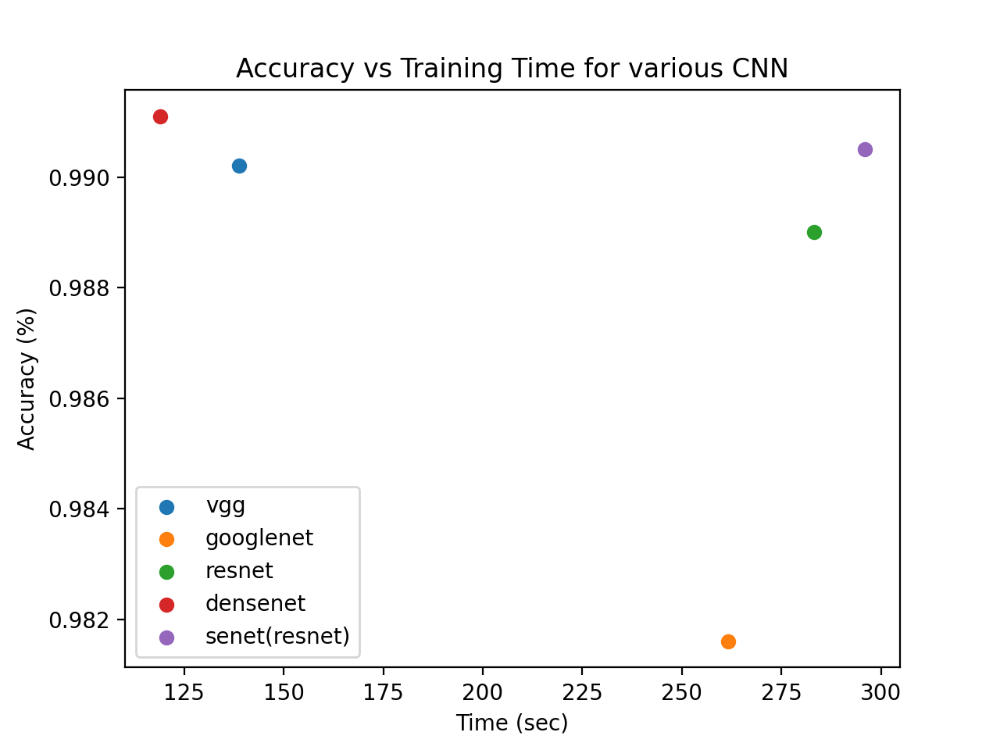

# COMP 487

### Project 1

March 24, 2022

Matt Hyatt, Ian Cummings

We implemented 5 of the modern CNNs described in class.  We tested them on the MNIST dataset after training for 5 epochs.  

Some issues arose when implementing deep CNNS (DenseNet, VGG) which reduced the dimension of our image to [batch_size, 0, 0, channels] We fixed these issues by removing some of the layers from the standard model.

Our results show that the best networks make revolutionary changes in the way information is processed rather than simply implementing larger AI models.  Our best performing network was a truncated version of DenseNet with 538k parameters. This network outperformed many of the larger networks like ResNet with 11.1M parameters.

